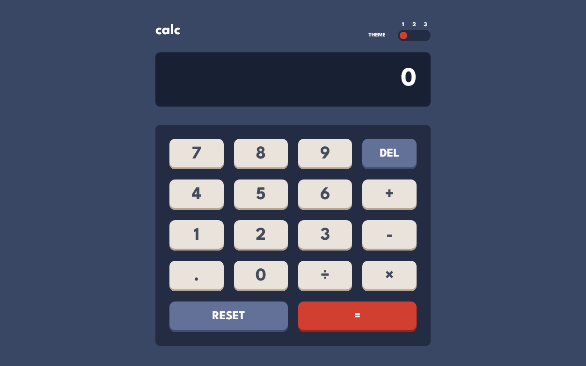

# Frontend Mentor - Calculator app solution

This is a solution to the [Calculator app challenge on Frontend Mentor](https://www.frontendmentor.io/challenges/calculator-app-9lteq5N29). Frontend Mentor challenges help you improve your coding skills by building realistic projects.

## Table of contents

- [Overview](#overview)
  - [The challenge](#the-challenge)
  - [Screenshot](#screenshot)
  - [Links](#links)
- [My process](#my-process)
  - [Built with](#built-with)
  - [What I learned](#what-i-learned)
  - [Continued development](#continued-development)
  - [Useful resources](#useful-resources)
- [Author](#author)

## Overview

### The challenge

Users should be able to:

- [x] See the size of the elements adjust based on their device's screen size
- [x] Perform mathmatical operations like addition, subtraction, multiplication, and division
- [x] Adjust the color theme based on their preference
- [x] **Bonus**: Have their initial theme preference checked using `prefers-color-scheme` and have any additional changes saved in the browser

### Screenshot

### Links

- Solution URL: [Source code](https://github.com/king-oldmate/calculator-fem)
- Live Site URL: [See it live](https://effulgent-snickerdoodle-a067c3.netlify.app/)

## My process

### Built with

- Semantic HTML5 markup
- CSS custom properties
- Flexbox
- CSS Grid
- Mobile-first workflow
- [React](https://reactjs.org/) - JS library

### What I learned

I feel like I had already learnt this, or it should have been obvious, but **nesting react components within eachother was just something I never did before**. It made organising code and layout a lot easier than in my other projects.

### Continued development

Nesting react coponents within each other. Also, using separate CSS files for each component also helped in organising my styles.

I need to actively practice protyping, psuedo-coding, and wireframing.

### Useful resources

- [Build calculator tutorial](https://www.sitepoint.com/react-tutorial-build-calculator-app/) - Not going to lie, this helped _a lot_, particularly with how to organise/structure my components.

## Author

- Website - [Raymond Zeaiter](https://www.raymond-zeaiter.au)
- Frontend Mentor - [@king-oldmate](https://www.frontendmentor.io/profile/king-oldmate)
- Twitter - [@RayZeaiter](https://www.twitter.com/RayZeaiter)
